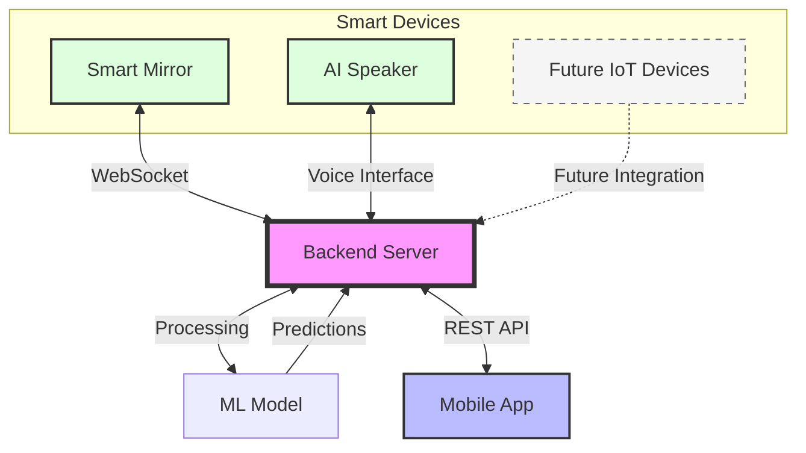

# ESG Home - 스마트 친환경 가정 플랫폼 🌳

## 프로젝트 소개
ESG Home은 가정에서 실천할 수 있는 친환경적 행동들을 가구 단위로 관리하는 스마트 홈 플랫폼입니다. AI 스피커, 스마트 미러, IoT 기기들을 통합적으로 활용하여 일상 생활 속 탄소 배출 감소를 돕습니다.

### 🎥 데모 & 프레젠테이션
- [서비스 데모 영상](https://youtu.be/PamBX9AE1z8)
- [프로젝트 발표 영상](https://youtu.be/5Zc9lnC0Gr0)

## ✨ 주요 기능

### 👨‍👩‍👧‍👦 가족 단위 환경 보호
- 가구 단위 탄소 배출량 통합 관리
- 가족 구성원 간 환경 보호 활동 공유
- 실시간 가구별 탄소 배출량 모니터링

### 🎯 AI 기반 맞춤형 추천
- 머신러닝 기반 개인화된 친환경 행동 추천
- 사용자 패턴 분석을 통한 최적화된 목표 설정
- 실시간 피드백 및 행동 가이드 제공

### 🔊 AI 스피커 연동
- 음성 인터페이스를 통한 편리한 서비스 이용
- 일상적인 대화를 통한 환경 보호 실천
- 실시간 음성 피드백 제공

### 📱 스마트 기기 통합
- 스마트 미러를 통한 실시간 모니터링
- IoT 기기들과의 원활한 연동
- 모바일 앱을 통한 통합 대시보드 제공

## 🛠 기술 스택

### Backend (This Repository)
- Python 3.8+
- Django 3.2.9
- Django REST Framework
- WebSocket
- JWT Authentication
- MySQL

### AI & Machine Learning
- 사용자 데이터 기반 예측 모델
- 개인화된 행동 패턴 분석
- 최적화된 목표 설정 알고리즘

### IoT Integration
- 스마트 미러 (현재 구현 완료)
- AI 스피커 (현재 구현 완료)
- 스마트 밥솥
- 스마트 냉장고

## 🚀 시작하기

1️⃣ 레포 클론

```
git clone https://github.com/SE-MAIL/server.git
cd server
```

2️⃣ 서버 실행
```
pip install -r requirements.txt
python manage.py runserver
```

## 📊 시스템 아키텍처

